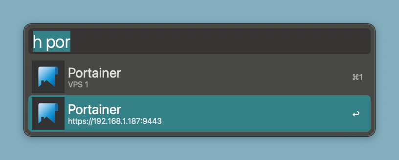

# Alfred Homepage workflow



An [Alfred](https://www.alfredapp.com) workflow to open bookmarks and services links from a [Homepage](https://gethomepage.dev) Instance.

Yes, there is a [downloadable release](https://github.com/yrocq/alfred-homepage/releases).

## Usage

- Open workflow in Alfred
- Provide your Homepage instance URL in configuration dialog
- Use **_h_** keyword + space + optional filter string
- Preview the URL by pressing cmd key on an entry
- Press Enter to open the URL in your browser

## Local development

This workflow is based on a _homepage_ command, written in Rust language. It uses [GNU Make](https://www.gnu.org/software/make/) as a build tool.

### Prerequisites

- Xcode
- Rust environment

### Build a release

At the root of the alfred-homepage directory, type:

```shell
make package
```

The workflow will be available in the workflow/package directory. The homepage command is an universal binary. It can run on Intel or Apple chips.
